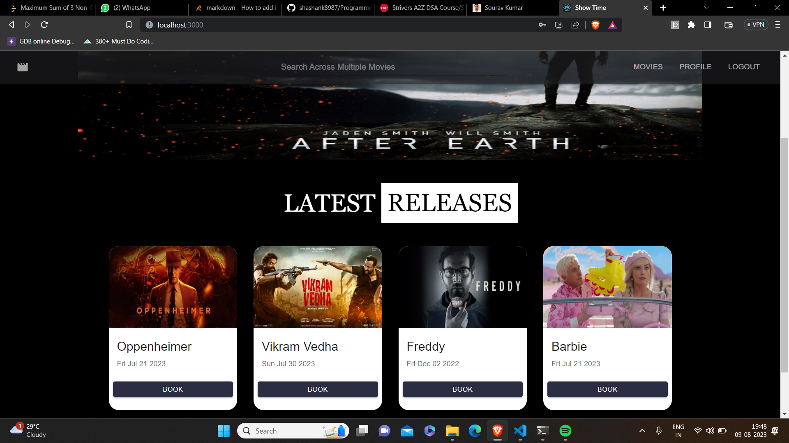
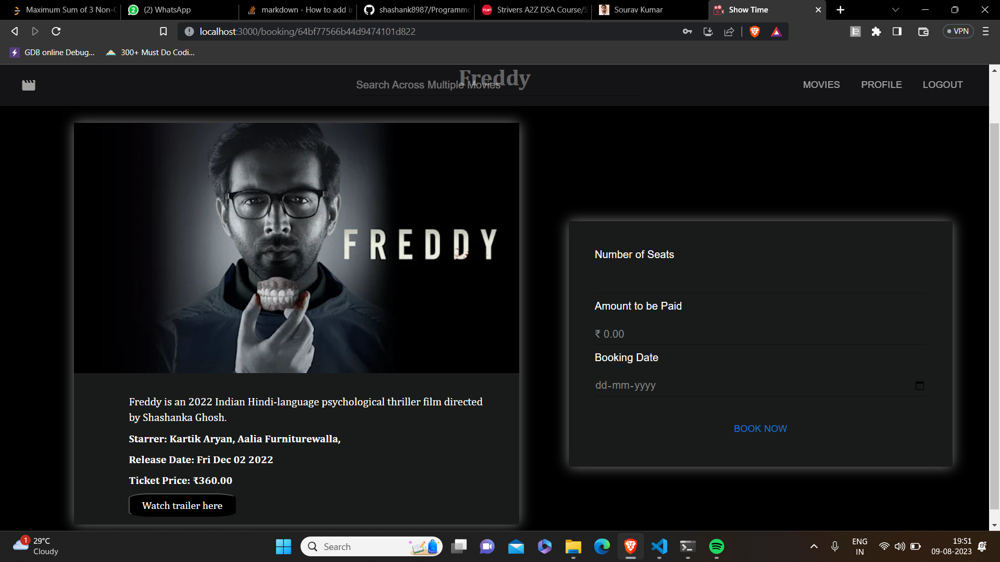

# SHOW-TIME
## _The movie booking application_


## Introduction:
- Featuring dual panels for both admin and users, Show-Time is a movie ticket booking website offering comprehensive functionality. 

- Admins efficiently manage movie listings, and timings, while users enjoy easy access to movie choices, seat selection, and secure bookings.

- Admin panel is only accessible by the admin, users cannot log in to the admin panel.

## Installation

- Git cloning the repository
```
git clone https://github.com/shashank8987/Show-Time.git
```
- Add your own env variables in .env file

- Installing all node modules for backend
```
cd backend
npm install
```
- Installing all react modules
```
cd frontend
npm install
```
- Go to the frontend directory and the following command to start the react server
```
npm start
```
- Go to the backend directory and the following command to start the backend server
```
npm run start
```

## Technology Stack:

- ReactJs
- NodeJs
- Express
- MongoDB
- Redux
- Web Tokens

## Screenshots:

- **If not registered, users can first signup and then login to the application**


<br/>
<br/>

- **The recently added 4 movies will be visible on the home page**


<br/>
<br/>

- **Users can go to All Movies section to view all the latest movies**


<br/>
<br/>

- **Users can also search for the latest movies**


<br/>
<br/>

- **Users can select the movie they want to book and on the booking page they can see the description, cast and Ticket Price of the movie**


<br/>
<br/>

- **Users can watch the trailer of the movie in the app itself**


<br/>
<br/>

- **Users can select the number of seats to be booked and the date of booking, the amount to be paid will be generated automatically. After booking, the popup will be generated on the bottom-left corner of the screen**


<br/>
<br/>

- **Users can see the list of bookings they made in the user-profile page**


<br/>
<br/>

- **Users can cancel the booking by clicking on the cancel(Red) button. The cancellation pop-up will be generated on the bottom-left side of the screen and the movie will be removed from the booked movies list**


<br/>
<br/>

- **Other than user, we have an admin panel as well which can be accessed only by an admin as users don't have the credentials for admin panel**


<br/>
<br/>

- **After login admin can go to their profile page and see the list of movies they have added**


<br/>
<br/>

- **Admin can also remove the movies that have became old by clicking on the red icon and the removal pop-up will be generated on the bottom-left of the screen and the movie will be removed from the list**


<br/>
<br/>

- **Admin can add the new movies in the list with the ticket price, description and casts of the movies**


<br/>
<br/>

- **Movie with it's detail will be added to the recent movies list**


<br/>
<br/>


